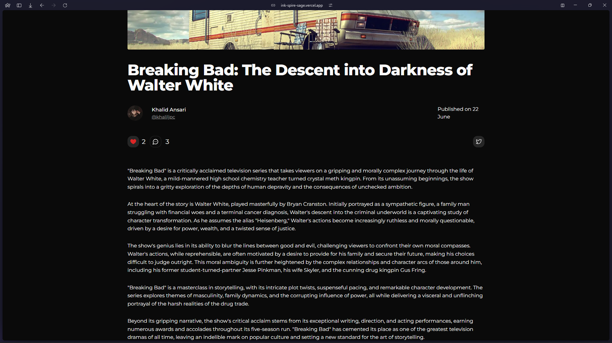

# Ink-Spire

https://ink-spire-sage.vercel.app/

A blogging website built using Next.js, MongoDB Atlas, Prisma, Editor.js, Shadcn etc.

## Features

1. **User Authentication and Authorization**

   - Secure login and registration system.
   - Password Reset functionality from Settings.
   - Google OAuth using Next Auth.

2. **Blog Creation and Management**

   - Rich text editor using Editor.js for creating and editing blog posts.
   - Support for embedding images.
   - Categorization and tagging of blog posts.
   - Draft and publish options for blog posts.
   - Sorting and Searching features with Pagination throughtout the application.
   - Dashboard for managing your blogs, viewing drafts, favroutie blogs etc.

3. **Commenting System**

   - Nested comments with the ability to reply to comments.
   - Real-time updates for new comments and replies.

4. **User Profiles**
   - Customizable user profiles with profile pictures and bio.
   - Display user’s blog posts and comments.

## Soon to Come Features

**Notifications**

- Real-time notifications for comments, likes, and follows.

## Getting Started

### Prerequisites

Ensure you have the following installed:

- [Node.js](https://nodejs.org/) (version 18 or higher recommended)
- [pnpm](https://pnpm.io/)

### Installation

1. Clone the repository:

   ```bash
   git clone https://github.com/khalid-09/InkSpire.git

   ```

2. Navigate to the project directory:

   ```bash
   cd InkSpire

   ```

3. Install the dependencies:

   ```bash
   pnpm i
   ```

### Running the development server

```bash
  pnpm dev
```

### Screenshots





